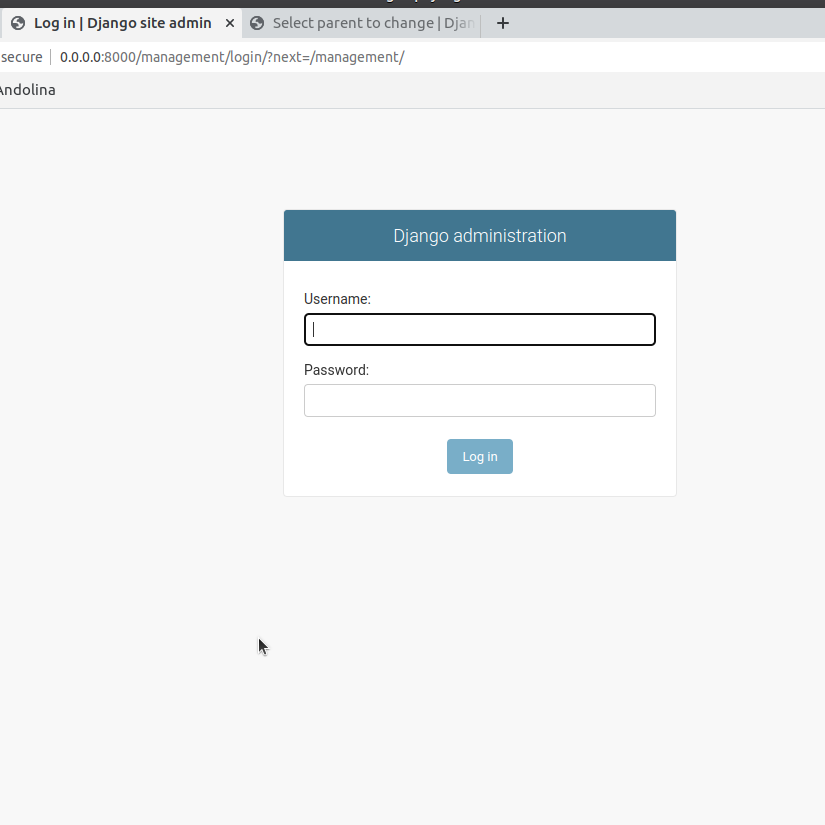
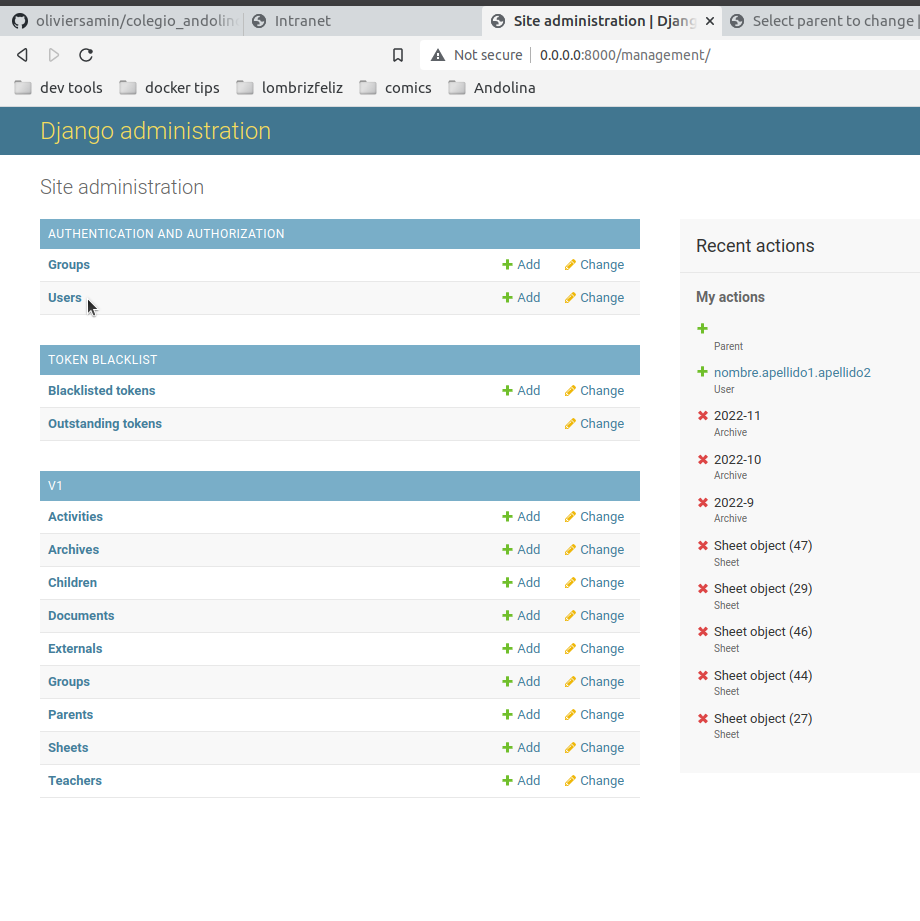
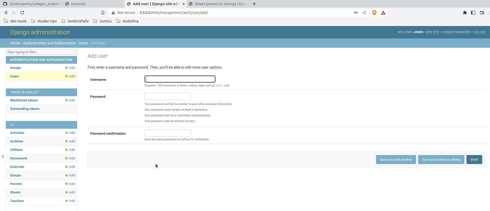

# Colegio Andolina
***
## Table of contents
1. [Overview of the Django project](#overview-of-the-django-project) 
2. [Admin actions to perform](#admin-actions-to-perform)

***

## Overview of the Django project  
- Django is a framework to help construct website, so it contains by default a lot of already implemented parts.  
- One of them is the Django admin site. This part is the place where any authorize person can go and perform actions. As an example, the administrator of the site is able to control a huge part of the site from here.   
- The Django site is made of pre-existing models such as Users, Groups and so on. 
- A model correspond to an object that can be manipulated and store inside the database.  
- The 4 actions used upon a database item are: Create, Read, Update and Delete.
- One can of course create its own models as we will see later for this project.
- Each person allowed to enter the django admin website can perform different actions regarding the right the administrator has given to him.
- Regarding the right of the person, he may be only able to see one model but no see the other for example....

Now let's dive into the admin website navigation and usage:

## Admin actions to perform  

### To create a new parent as part of the school
One can find a video tutorial to do so here  or follow the instructions below:

1. Connect to the admin site (/management/) 

2. enter the login 'admin' and the password 'andolina'
3. In the 'AUTHENTICATION AND AUTHORIZATION' section, click on the '+Add' button corresponding to the 'Users' line:
4. Create a new django user with a standard password ('test_passwd') that will be given to the parent so that they can use it for their interface (one can find details of this interface [here](parent_usage_documentation.md))
   1. 
   2. The username has to be the following code: 
      1. if there are two last names all in lower case: <first_name>.<last_name1>.<last_name2> | Example: paula.gonzalez.diaz
      2. if there is only one last name all in lower case: <first_name>.<last_name> | Example: olivier.samin
   3. 